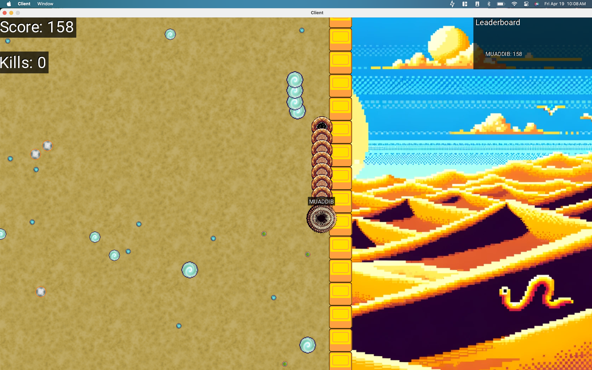

# Dune-Snake

<!-- TODO  -->

A game of Snake built using C# in the MonoGame framework, themed around everyone's favorite Sci-Fi franchise: [Dune](https://www.sfgate.com/sf-culture/article/dune-part-two-review-18678628.php).

<!-- ## Project Description -->

## In Progress

- [ ] Satchel: Pick head, body, and tail texture for the sandworm
- [ ] Satchel: Keyboard vs. Mouse input menu screen - Satchel
- [ ] Caden: Map generation
- [ ] Max: Snake Movement with the queue system

- [ ] Caden: Spice generation when we spawn
- [ ] Caden: Periodic spice generation throughout the game

## Items to Develop

- [ ] Menu Screen to let player name themselves (probably similar to how control selection screen will work) - Satchel
- [ ] Keyboard support for left, right, up, down, diagonal up left and diagonal up right. Also add these to the wormMovement system.
- [ ] 3 different animated sprites for the spice
- [ ] Mouse input support on Menu Screens
- [ ] Sound effects on death of worm and when food is eaten - Satchel
- [ ] Collision detection. Know whether we hit spice or another sandworm
- [ ] On collision, sandworm breaks apart and is available as food for other snakes
- [ ] Record players score, kills and highest position. Probably can be added to the `GameScores` object.
- [ ] Game over screen with score, kills, and highest position achieved
- [ ] Particle system for the death of a sandworm
- [ ] Game continues to show/play even after the player dies
- [ ] Leaderboard to display top 5 players and client's score
- [ ] The new player should join as an invincible entity. Add this functionality and a system to update it after 3 seconds to be removed from the entity.
- [ ] Add a player status in leaderboard to show whether the player is currently invincible.

## Done

- [x] Max: Upgrade our movement system to reduce the lag in rotation
- [x] Max: Add name support for the player
- [x] Max: Setup Snake Movement in the screen
- [x] Max: Decide how to build the snake. Tons of entities? Or one entity with a list of positions?
- [x] Max: Setup basic menuing
- [x] Caden: Camera movement
- [x] Satchel: Mouse Input Support

## Debugging

### Connection Refused

- Try switching ports. A few options are 4000, 4010, 3000, 3010
- Use netcat on Mac or Linux to see whether the server is available.
  `nc -vz 192.168.4.20 3000`
- Turn off your firewall. On macOS that is found in System Preferences > Security & Privacy > Firewall
